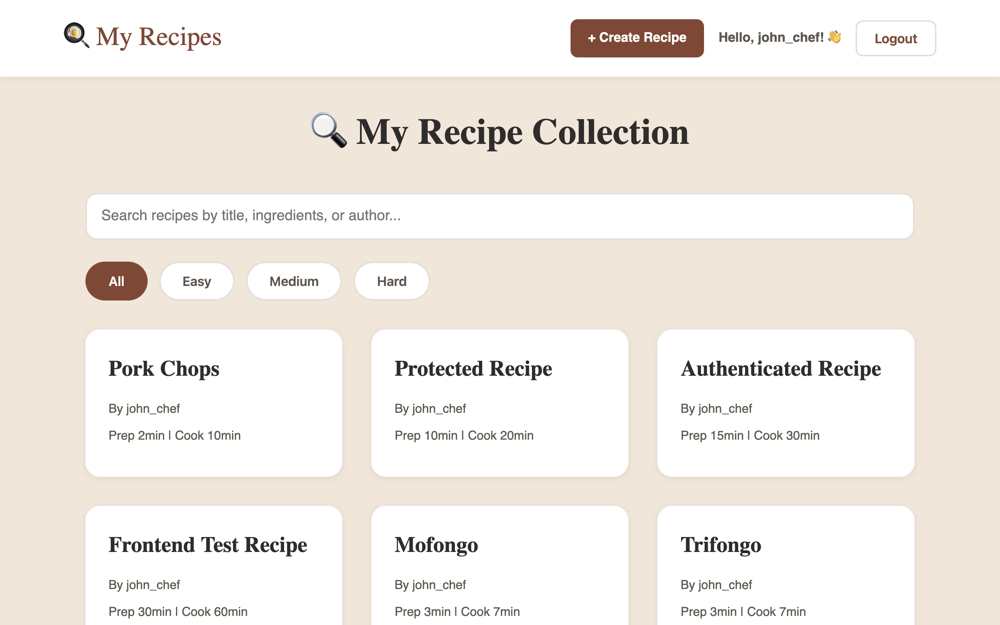
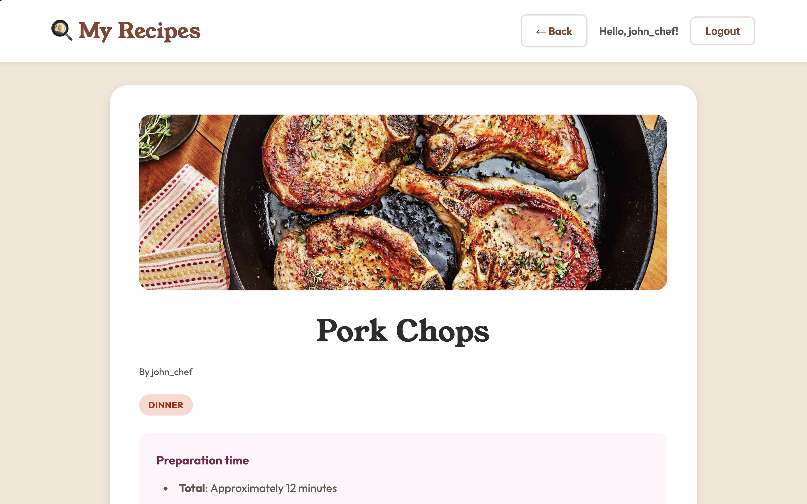
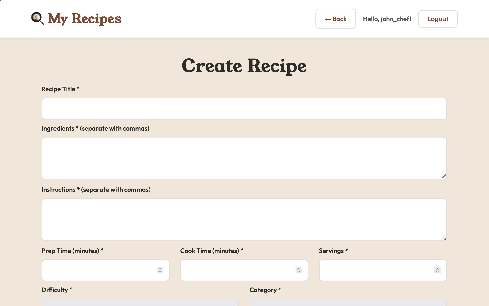
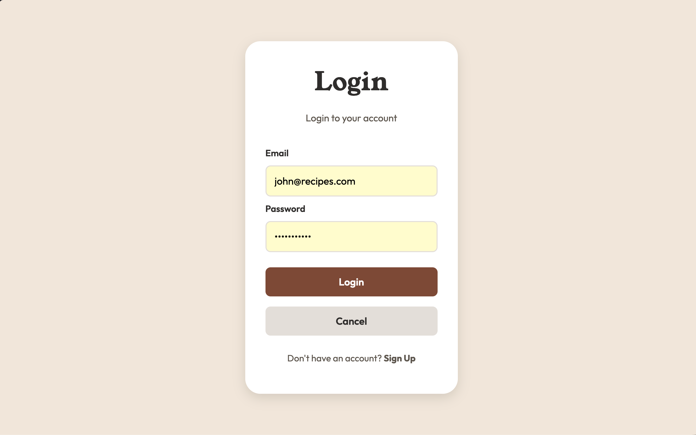

# 🍳 Recipe Management App

A full-stack recipe management application built with React and Express. Users can create, edit, search, and share their favorite recipes with image uploads and user authentication.

🔗 **[Live Demo](https://recipes-app-wqp6.onrender.com)** | 📂 **[GitHub Repository](https://github.com/nadielotiene/recipe-app-react)**

---

## 📸 Screenshots

### Home Page - Recipe Collection

*Browse all recipes with search and filter options*

### Recipe Detail View

*View complete recipe details including ingredients, instructions, and cooking times*

### Create/Edit Recipe

*Easy-to-use form with image upload support*

### User Authentication

*Secure login and signup with JWT authentication*

---

## ✨ Features

- **🔐 User Authentication** - Secure JWT-based login and signup
- **📝 Full CRUD Operations** - Create, read, update, and delete recipes
- **🖼️ Image Upload** - Upload recipe photos with automatic storage
- **🔍 Search & Filter** - Search by title, ingredients, or author; filter by difficulty level
- **👤 User Ownership** - Users can only edit/delete their own recipes
- **📱 Responsive Design** - Mobile-friendly interface with clean UI
- **⚡ Loading States** - Smooth loading indicators for better UX
- **🎨 Category System** - Organize recipes by meal type (Breakfast, Lunch, Dinner, Dessert, Snacks)

---

## 🛠️ Tech Stack

### Frontend
- **React 18** - UI library with hooks
- **React Router v6** - Client-side routing
- **Vite** - Fast build tool and dev server
- **CSS3** - Custom styling with CSS variables

### Backend
- **Node.js** - JavaScript runtime
- **Express.js** - Web framework
- **SQLite (better-sqlite3)** - Lightweight database
- **JWT (jsonwebtoken)** - Authentication
- **Multer** - File upload handling
- **bcrypt** - Password hashing

### Deployment
- **Render** - Hosting platform (web service)
- **GitHub** - Version control

---

## 🚀 Getting Started

### Prerequisites
- Node.js (v16 or higher)
- npm or yarn

### Installation

1. **Clone the repository**
   ```bash
   git clone https://github.com/nadielotiene/recipe-app-react.git
   cd recipe-app-react
   ```

2. **Install dependencies**
   ```bash
   npm install
   ```

3. **Set up environment variables**
   
   Create a `.env` file in the root directory:
   ```env
   JWT_SECRET=your_secret_key_here
   PORT=3000
   ```

4. **Build the React frontend**
   ```bash
   npm run build
   ```

5. **Start the server**
   ```bash
   node server.cjs
   ```

6. **Access the app**
   
   Open your browser and navigate to `http://localhost:3000`

---

## 🧪 Test Credentials

For testing purposes, you can use these pre-created accounts:

- **Email:** `john@recipes.com`  
  **Password:** `password123`

- **Email:** `maria@recipes.com`  
  **Password:** `password123`

- **Email:** `alex@recipes.com`  
  **Password:** `password123`

---

## 📁 Project Structure

```
recipe-app-react/
├── src/                      # React source files
│   ├── components/          # React components
│   │   ├── Navbar.jsx
│   │   ├── RecipeList.jsx
│   │   ├── RecipeCard.jsx
│   │   ├── RecipeDetail.jsx
│   │   ├── RecipeForm.jsx
│   │   ├── Login.jsx
│   │   ├── Loading.jsx
│   │   └── ScrollToTop.jsx
│   ├── App.jsx              # Main app component with routing
│   ├── config.js            # API configuration
│   └── main.jsx             # React entry point
├── public/                   # Static assets
├── screenshots/              # Project screenshots
├── uploads/                  # User-uploaded images (gitignored)
├── server.cjs               # Express backend server
├── recipes-database.js      # Database initialization
├── recipes.db               # SQLite database (gitignored)
├── package.json
└── vite.config.js
```

---

## 🔌 API Endpoints

### Authentication
- `POST /api/auth/signup` - Create new user account
- `POST /api/auth/login` - Login and receive JWT token

### Recipes
- `GET /api/recipes` - Get all recipes (optional: `?filter=easy|medium|hard`)
- `GET /api/recipes/:id` - Get single recipe by ID
- `GET /api/recipes/search?q=query` - Search recipes
- `POST /api/recipes` - Create new recipe (auth required)
- `PUT /api/recipes/:id` - Update recipe (auth required, owner only)
- `DELETE /api/recipes/:id` - Delete recipe (auth required, owner only)

### Other
- `GET /api/stats` - Get recipe statistics

---

## 🎨 Key Features Implementation

### Component Architecture
- **Reusable Components** - Separated concerns with props-based components
- **React Router** - Single Page Application with client-side routing
- **State Management** - useState and useEffect hooks for local state
- **Conditional Rendering** - Dynamic UI based on authentication and data state

### Authentication Flow
1. User signs up or logs in via `/login`
2. Backend validates credentials and returns JWT token
3. Token stored in localStorage
4. Token sent in Authorization header for protected routes
5. Backend middleware validates token on protected endpoints

### Image Upload Flow
1. User selects image in RecipeForm
2. Form uses FormData to send multipart/form-data
3. Multer middleware processes file upload
4. File saved to `/uploads` directory with unique filename
5. Filename stored in database
6. Images served via Express static middleware

---

## 🔒 Security Features

- **Password Hashing** - bcrypt with salt rounds for secure password storage
- **JWT Authentication** - Stateless authentication with 7-day expiration
- **Input Validation** - Server-side validation for all inputs
- **CORS Configuration** - Controlled cross-origin requests
- **Owner Authorization** - Users can only modify their own recipes

---

## 🚀 Deployment

This app is deployed on Render with the following configuration:

**Build Command:**
```bash
npm install && npm run build
```

**Start Command:**
```bash
node server.cjs
```

**Environment Variables (on Render):**
- `JWT_SECRET` - Secret key for JWT signing
- `PORT` - Port number (auto-assigned by Render)

---

## 💡 Challenges & Solutions

### Challenge 1: Serving React SPA and Express API from one server
**Solution:** Configure Express to serve built React files statically, with a catch-all route that sends `index.html` for non-API routes. This allows React Router to handle client-side routing while Express handles API requests.

### Challenge 2: Image uploads with React forms
**Solution:** Used `FormData` instead of JSON for forms with file inputs. Configured Multer to handle multipart/form-data on the backend with proper file type validation and size limits.

### Challenge 3: Slow loading on free-tier hosting
**Solution:** Implemented loading spinners and disabled button states during async operations to provide feedback during cold starts and network delays.

### Challenge 4: Maintaining auth state across page refreshes
**Solution:** Store JWT token and user data in localStorage, then initialize React state from localStorage on app mount. This persists authentication across browser sessions.

---

## 🔮 Future Enhancements

- [ ] Recipe ratings and reviews
- [ ] Favorites/bookmarking system
- [ ] Recipe categories with filtering
- [ ] Print-friendly recipe view
- [ ] Social sharing functionality
- [ ] Recipe import from URL
- [ ] Shopping list generation - Compile ingredients from multiple recipes into a shopping list
- [ ] Meal planning calendar - Plan weekly meals and automatically generate shopping lists
- [ ] Ingredient shopping list generator
- [ ] Cooking timer integration
- [ ] User profile pages
- [ ] Recipe duplication feature

---

## 📝 What I Learned

Building this project helped me solidify my understanding of:

- **Full-stack development** - Connecting React frontend with Express backend
- **React fundamentals** - Component lifecycle, hooks (useState, useEffect), conditional rendering
- **React Router** - Client-side routing, URL parameters, programmatic navigation
- **Authentication** - JWT tokens, localStorage, protected routes
- **Form handling** - Controlled inputs, FormData, file uploads
- **API design** - RESTful endpoints, error handling, validation
- **Deployment** - Build processes, environment variables, production configuration

---

## 📄 License

This project is licensed under the MIT License - see the [LICENSE](LICENSE) file for details.

---

## 👤 Author

**Kenny Dev**

- GitHub: [@nadielotiene](https://github.com/nadielotiene)
- Portfolio: [Portfolio](https://my-portfolio-six-jet-80.vercel.app/)
- LinkedIn: [LinkedIn](https://www.linkedin.com/in/kenneth-velazquez-dev/)

---

## 🙏 Acknowledgments

- Design inspiration from various recipe management apps
- Icons and fonts from Google Fonts
- Deployed on Render's free tier
- Built as a learning project to practice React and full-stack development

---

**⭐ If you found this project helpful, please consider giving it a star!**
